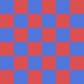

# Sample with Images

Testing image rendering in **MarkdownViewer** and the Quick Look extension.

## Local image (relative path)

A 120×120 checkerboard generated from disk and inlined as a `data:` URL by
`MarkdownRenderer.inlineLocalImages`:

## Remote image

A small badge fetched from the network (requires `network.client`
entitlement, which the QL extension has):

## Inline reference

Text with an inline image —  — to confirm sizing
behaves like GitHub.
